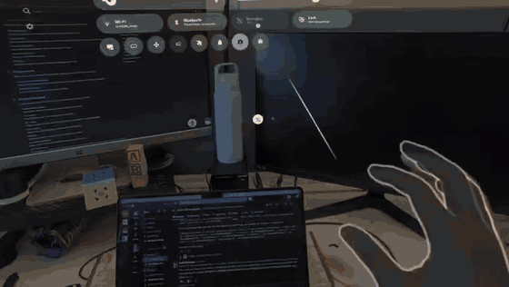
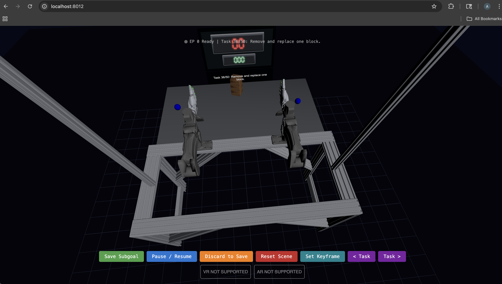

# Getting Started: VR Data Collection

Use this guide to set up the hardware, launch the VR teleoperation system, and save collected episodes.

Before sharing externally, replace each TODO image with the named file under `docs/images/`.

## Equipment

| Item | Notes |
| --- | --- |
| Meta Quest 3 | Enable Developer Mode and hand tracking before the first collection session. |
| Programmable USB foot pedal | Use a 3-button pedal if possible. Configure the buttons to send keyboard keys `A`, `B`, and `C`. Plug it into the computer running the streamer. |
| USB-C data cable | Must support data, not just charging. Use this to connect the Quest 3 to the computer for `adb reverse`. |
| Host computer | Needs this repo, Python 3.10, `uv`, Node/npm, and Android platform tools (`adb`). |


## One-Time Setup

1. Clone the repo onto the host computer.

2. Install Python and frontend dependencies:

   ```bash
   ./setup.sh all
   ```

3. Connect the Quest 3 with the USB-C cable.

4. In the headset, accept the USB debugging or developer access prompt.

   [](media/quest-usb-debugging.mp4)

   Video file: [Quest USB debugging prompt](media/quest-usb-debugging.mp4)

5. Confirm the headset is visible:

   ```bash
   adb devices
   ```

6. Forward the local VR server port to the headset:

   ```bash
   adb reverse tcp:8012 tcp:8012
   ```

## Start a Collection Session

1. Plug the foot pedal into the host computer.

2. Start the streamer:

   ```bash
   npm run build --prefix frontend && \
   uv run python -m mujoco_vr_teleop.vr_streamer \
     --builder.arm-type yam_ultra \
     --builder.end-effector sharpa \
     --builder.finger-control ik \
     --builder.scene-type jenga \
     --pedal-control \
     --session-name default
   ```

3. In the Quest browser, open:

   ```text
   http://localhost:8012/
   ```

   

4. Enter VR from the browser page.

## Operator Controls

The foot pedal is mapped left-to-right: left pedal sends `A`, middle pedal sends `B`, and right pedal sends `C`.

| Pedal/key | Action |
| --- | --- |
| `B` | Start, pause, or resume tracking and recording. |
| `A` | Save a checkpoint. Use this after each successful segment. |
| Tap `C` | Discard work since the last checkpoint, revert, and pause. |
| Hold `C` for about 2 seconds | Finalize the current checkpointed episode and reset the scene for the next episode. |

Keyboard keys `A`, `B`, and `C` work the same way if the pedal is not connected.

## Data Output

Saved data is written under:

```text
data/<session-name>/<timestamp>/ep_00000/ep_00000.zarr
```

Each episode folder also includes `replay_config.json`. Send the full `data/<session-name>/<timestamp>/` folder when sharing collected data.

To quickly replay an episode:

```bash
uv run python -m mujoco_vr_teleop.replay_trajectory_open_loop \
  data/default/<timestamp>/ep_00000/ \
  --mp4-out data/default/<timestamp>/ep_00000/replay_top.mp4 \
  --camera top
```

## Collection Checklist

- Quest 3 connected and accepted USB debugging.
- `adb reverse tcp:8012 tcp:8012` has been run.
- Foot pedal is plugged into the host computer and emits `A`, `B`, `C`.
- Streamer is running without errors.
- Quest browser is connected to the VR server.
- Operator uses `A` after each good segment and holds `C` after the episode is complete.
